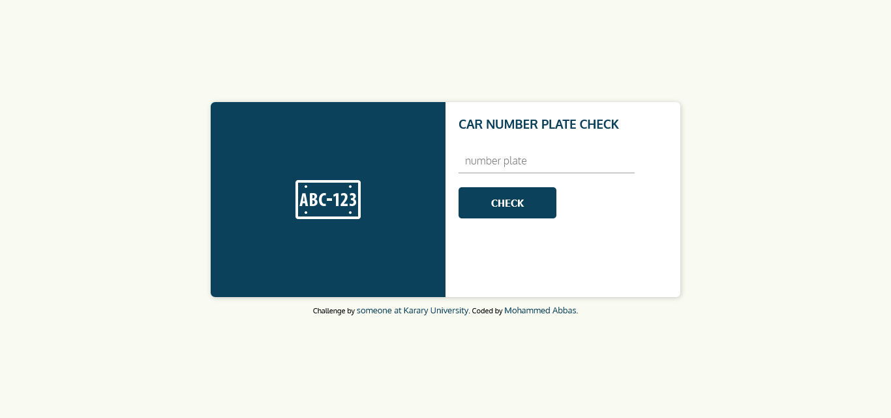
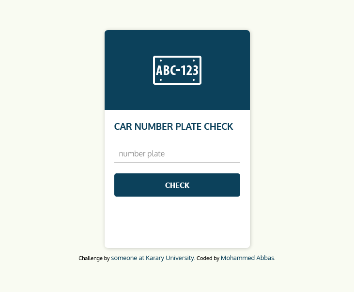

# simple car number plate check 

This is a simple car number plate check inspired by someone at Karary University.

## Table of contents

- [Overview](#overview)
  - [The challenge](#the-challenge)
  - [Screenshot](#screenshot)
- [My process](#my-process)
  - [Built with](#built-with)
  - [What I learned](#what-i-learned)
  - [Useful resources](#useful-resources)

## Overview

### About the site

With this simple car number plate check site, you can enter your car number plate and the app gives you the location where you have been licensed your car and the type of your car.

Users should be able to:

- View the optimal layout depending on their device's screen size
- See hover states for interactive elements

### Screenshot

## My process

### Built with

- Semantic HTML5 markup
- Flexbox
- php for server-side

### What I learned

I learned how to use regular expressions on PHP and use it to check if the user has input the right value inside the form field.

### Useful resources

- [regular expressions](https://regexr.com) - This site helped me to learn regular expressions and also to use it to test my regular expressions.

